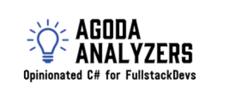

This project is used by Agoda Internally for analysis of our C# projects. We have opened it for community contribution.

In order to debug this project please select the Agoda.Analyzers.Vsix as the start up project and it will launch VS2017 in experimental mode and you can test the Analysis rules. You will be debugging Roslyn rules running in the second instance of VS from the first. You'll need to set a breakpoint in the first instance.

To generate a jar file from this project for use with soarqube we have prepared a fork of the sonar team's project that has been udpated to 1.3 here https://github.com/agoda-com/sonarqube-roslyn-sdk

## Dive straight in?

Take a look at [the analyzer for our test method names](https://github.com/agoda-com/AgodaAnalyzers/blob/master/src/Agoda.Analyzers/AgodaCustom/AG0005TestMethodNamesMustFollowConvention.cs) which is fairly simple but not trivial. 

## Anatomy of a Roslyn analyzer

An analyzer inherits from the abstract class [`DiagnosticAnalyzer`](https://docs.microsoft.com/en-us/dotnet/api/microsoft.codeanalysis.diagnostics.diagnosticanalyzer?view=roslyn-dotnet). It requires us to override two members:

### [`SupportedDiagnostics`](https://docs.microsoft.com/en-us/dotnet/api/microsoft.codeanalysis.diagnostics.diagnosticanalyzer.supporteddiagnostics?view=roslyn-dotnet)

A property specifying one or more [`DiagnosticDescriptor`](https://docs.microsoft.com/en-us/dotnet/api/microsoft.codeanalysis.diagnosticdescriptor?view=roslyn-dotnet)s representing the metadata of your analyzer, for instance the title, error message, severity, etc.

### [`Initialize`](https://docs.microsoft.com/en-us/dotnet/api/microsoft.codeanalysis.diagnostics.diagnosticanalyzer.initialize?view=roslyn-dotnet)

Called by the hosting environment (eg. Visual Studio) to bootstrap your analyzer. In this method, we tell the Roslyn compiler:
- which [`SyntaxKinds`](https://docs.microsoft.com/en-us/dotnet/api/microsoft.codeanalysis.csharp.syntaxkind?view=roslyn-dotnet) we are interested in analyzing (eg. MethodDeclaration, ClassDeclaration, Parameter)
- for each of these SyntaxKinds, what method should be called to perform the actual analysis.

Here is an example:

```c#
public override void Initialize(AnalysisContext context)
{
    // Each time the compiler encounters a method declaration, call the AnalyzeNode method. 
    context.RegisterSyntaxNodeAction(AnalyzeNode, SyntaxKind.MethodDeclaration);
}
```

### The AnalyzeNode method

This is where the fun begins. Each time the Roslyn compiler encounters a node with a registered `SyntaxKind` it will call our AnalyzeNode method with the context. For example:

```c#
private void AnalyzeNode(SyntaxNodeAnalysisContext context)
{
    // Upcast the node to the type that corresponds to the specific SyntaxKind we registered: 
    var methodDeclarationSyntax = (MethodDeclarationSyntax) context.Node;
    
    // We can now do syntactic ("textual") analysis, such as checking if the method has a public modifier:
    if (methodDeclarationSyntax.Modifiers.Any(SyntaxKind.PublicKeyword))
    {
        // ...
    }
    
    // We can also do semantic analysis, which gives us far deeper inspection opportunities than just 
    // looking at the syntax.
    var methodDeclarationSymbol = context.SemanticModel.GetDeclaredSymbol(methodDeclarationSyntax);
    
    // For example, we can check if it's an extension method: 
    if (methodDeclarationSymbol.IsExtensionMethod)
    {
        // ...
    }
    
    // Or we can get its attributes:
    var methodAttributes = methodDeclarationSymbol.GetAttributes();
    
    // Or anything else that the compiler can possibly know.

    // If we find a problem, we report it like this. The Descriptor here refers to one of the descriptors
    // we passed to the SupportedDiagnostics property above.
    if (weFoundAnError) 
    {
        context.ReportDiagnostic(Diagnostic.Create(Descriptor, methodDeclaration.GetLocation()));
    }
}
```

## Contributing

[Please read the contributing guidelines](CONTRIBUTING.md)
